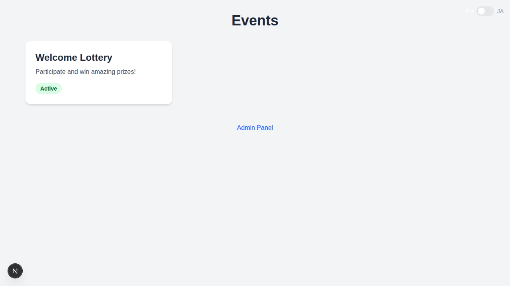

# 抽選システム (Lottery System)

[](docs/demo.webm)

このプロジェクトは、Next.js (App Router) をベースにした、Web上で動作する多言語対応の抽選システムです。管理者がイベントや景品を管理し、ユーザーがルーレット形式で抽選に参加することができます。

## 主な機能

- **多言語対応 (日本語/英語)**: 全画面で日本語と英語の切り替えが可能です。
- **抽選イベント管理**: 管理画面から新しい抽選イベントの作成、景品の追加・編集、在庫管理を行うことができます。
- **動的な確率計算**: 在庫数（count）に基づいて、自動的に当選確率が割り振られるロジックを搭載しています。
- **リアルタイム抽選ホイール**: ユーザーはルーレットを回し（SPIN）、任意のタイミングで停止（STOP）させることで抽選結果を得られます。
- **当選・引換フロー**: 
  - 当選時、ユニークなトークンとQRコードが生成されます。
  - 管理者はトークンを検証し、「引換済み」として処理することができます。
- **ダークモード/モダンなUI**: Tailwind CSSによる洗練されたデザインを採用しています。

## 開発の始め方

### サーバーの起動

```bash
npm install
npx prisma db push
npx prisma db seed
npm run dev
```

[http://localhost:3000](http://localhost:3000) を開いて確認してください。

## テスト

本プロジェクトでは、信頼性を確保するために複数のレイヤーでテストを実施しています。

### Jest (ユニット・統合テスト)

バックエンドのロジックやAPIエンドポイントの検証に使用しています。

- **ユニットテスト (`src/__tests__/unit/`)**:
  - `rewards.test.ts`: 景品の在庫数に基づいた当選確率の動的な再計算ロジックが、正しく計算されるかを検証します。
- **統合テスト (`src/__tests__/integration/`)**:
  - `claim.test.ts`: 抽選景品の請求API (`/api/claim`) の挙動を検証します。トランザクション処理、当選時のログ生成、落選時の処理などが正しく行われることを確認します。

実行コマンド:
```bash
npm test
```

### Playwright (E2Eテスト)

実際のブラウザを使用して、ユーザーと管理者の操作フロー（E2E）を一貫して検証します。

- **主なテストケース (`tests/e2e/lottery-flow.spec.ts`)**:
  - 管理画面でのイベント設定確認。
  - ユーザーによる抽選への参加（回転から停止まで）。
  - 当選結果の表示およびトークン/QRコードの確認。
  - 管理者によるトークンの検証および景品引換処理の完遂。

実行コマンド:
```bash
# アプリケーションが起動している必要があります
npm run test:e2e
```

### Dockerを用いたテスト実行 (推奨)

環境に依存せず、すべてのテストをクリーンなコンテナ環境で実行できます。

```bash
docker compose -f docker-compose.test.yml up --build --abort-on-container-exit
```

## 技術スタック

- **フロントエンド**: Next.js 16 (App Router), React 19, Tailwind CSS
- **バックエンド**: Prisma (ORM), SQLite
- **テスト基盤**: Jest, Playwright, React Testing Library
- **ライブラリ**: canvas-confetti, qrcode.react, lucide-react
